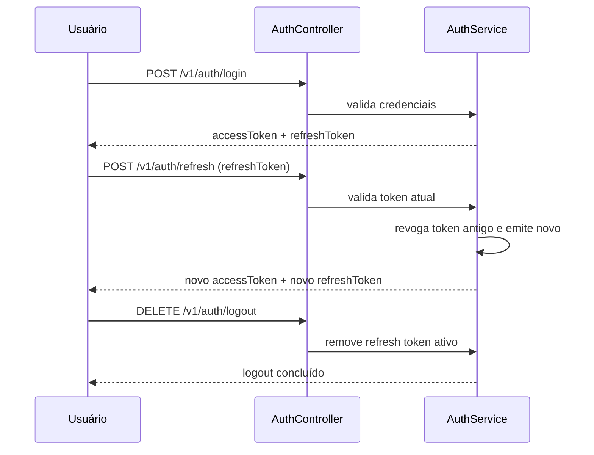
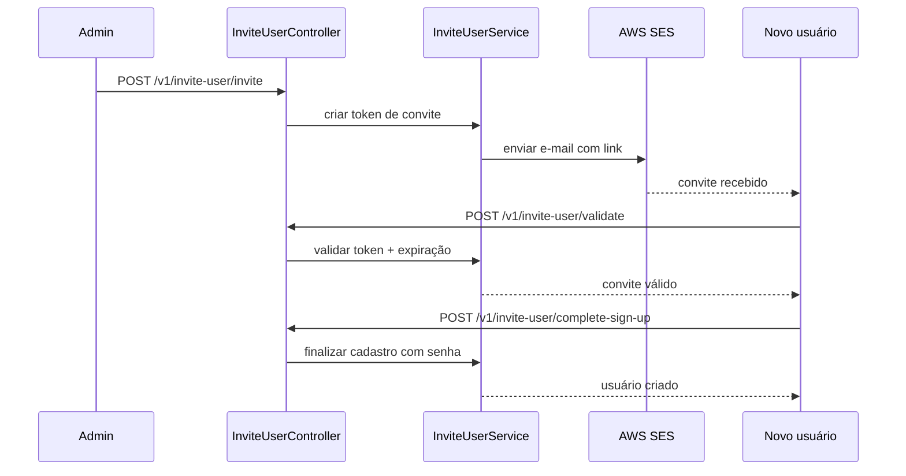

# NestShield Auth API

API em NestJS focada em autenticação e segurança, com fluxos de convite, trilha de auditoria e observabilidade.

## Visão geral
- API versionada por URI: `/v1/...`
- Swagger em `/docs`
- Persistência em memória (tokens, usuários, convites e auditoria)
- Estrutura modular com separação por camadas (`presentation`, `application`, `infrastructure`)

## Funcionalidades principais

### Autenticação
- Sign-up, login, refresh e logout
- Refresh token com rotação por dispositivo (IP + user-agent)
- Forgot password, reset password e change password
- JWT Bearer para rotas protegidas

### Autorização
- RBAC com `@Roles()`
- Permissões finas com `@Permissions()`
- ABAC com `@CheckPolicies()` (ex.: usuário comum só acessa o próprio recurso)

### Segurança
- CSRF middleware opcional (`CSRF_ENABLED=true`)
- Headers de hardening com `helmet`
- Mitigação de brute force com lockout + backoff progressivo no login
- Rate limit para anônimos (autenticados e health checks são ignorados)
- Canal de integração com `API Key` ou `OAuth2 Bearer` (tokens via env)

### Auditoria
- Interceptor global para operações mutáveis (`POST`, `PUT`, `PATCH`, `DELETE`)
- Registro de ator, rota, status HTTP, duração, IP e user-agent
- Consulta de eventos em `/v1/audit/events` (admin)

### Observabilidade
- Tracing distribuído com OpenTelemetry (OTLP HTTP)
- Logs estruturados com `nestjs-pino` (correlação com `trace_id`/`span_id`)
- Health checks avançados em `/v1/health/live` e `/v1/health/ready`

## Fluxos (Mermaid)

### 1) Fluxo de requisição na API
```mermaid
flowchart LR
    C[Cliente] --> V[/v1/*]
    V --> M[CSRF Middleware]
    M --> T[Throttler Guard]
    T --> G{Rota protegida?}
    G -- Não --> CT[Controller]
    G -- Sim --> J[JwtAuthGuard]
    J --> A[AuthorizationGuard\nRBAC/ABAC]
    A --> CT
    CT --> S[Application Service]
    S --> I[(In-memory Store)]
    CT --> R[Resposta]

    S -. mutating routes .-> AU[Audit Interceptor]
    AU -. record .-> AR[(Audit Repository)]
```

### 2) Fluxo de autenticação + rotação de refresh


### 3) Fluxo de convite (onboarding)


## Arquitetura de pastas (canônica)
```text
src/
  app.module.ts
  main.ts

  auth/
    presentation/controllers/
    application/services/
    infrastructure/guards/
    infrastructure/strategies/
    authorization/
    dto/
    entities/

  users/
    presentation/controllers/
    application/services/
    entities/

  invite-user/
    presentation/controllers/
    application/services/
    dto/
    entities/

  security/
    presentation/guards/
    application/services/
    middlewares/

  audit/
    domain/
    application/ports/
    application/use-cases/
    application/services/
    infrastructure/repositories/
    presentation/controllers/
    presentation/interceptors/

  observability/
  health/
  integrations/
  rate-limit/
  aws/
  crypto/
```

Nota: alguns caminhos legados (`controllers/`, `services/`, etc.) ainda existem como re-export para compatibilidade durante migração.

## Endpoints

### Auth
| Método | Rota | Auth | Descrição |
| --- | --- | --- | --- |
| POST | `/v1/auth/sign-up` | Não | Cria conta e retorna tokens |
| POST | `/v1/auth/login` | Não | Login e emissão de tokens |
| POST | `/v1/auth/refresh` | Não | Rotaciona refresh token e emite novo access |
| DELETE | `/v1/auth/logout` | Não | Revoga refresh token |
| POST | `/v1/auth/forgot-password` | Não | Inicia fluxo de reset por e-mail |
| POST | `/v1/auth/reset-password` | Não | Reseta senha via token |
| POST | `/v1/auth/change-password` | Bearer | Altera senha do usuário autenticado |

### Invite user
| Método | Rota | Auth | Descrição |
| --- | --- | --- | --- |
| POST | `/v1/invite-user/invite` | Bearer (admin) | Envia convite |
| POST | `/v1/invite-user/resend` | Bearer (admin) | Reenvia convite |
| POST | `/v1/invite-user/validate` | Não | Valida token de convite |
| POST | `/v1/invite-user/cancel` | Bearer (admin) | Cancela convite |
| POST | `/v1/invite-user/complete-sign-up` | Não | Finaliza cadastro via convite |

### Users, audit, integrations e health
| Método | Rota | Auth | Descrição |
| --- | --- | --- | --- |
| GET | `/v1/users/me` | Bearer | Perfil do usuário autenticado |
| GET | `/v1/users/:id` | Bearer + ABAC | Usuário comum: próprio ID, admin: qualquer ID |
| GET | `/v1/audit/events` | Bearer (admin) | Lista eventos de auditoria |
| GET | `/v1/integrations/status` | API Key ou OAuth2 Bearer | Status para integrações |
| GET | `/v1/health/live` | Não | Liveness |
| GET | `/v1/health/ready` | Não | Readiness (memória, disco, event loop, dependência opcional) |

## Variáveis de ambiente
Use `.env.example` como base.

Principais variáveis:
- `ACCESS_SECRET`, `REFRESH_SECRET`, `PASSWORD_PEPPER`
- `AUTH_MAX_LOGIN_ATTEMPTS`, `AUTH_LOCKOUT_MINUTES`, `AUTH_LOGIN_BACKOFF_MAX_MS`
- `RESET_PASSWORD_URL`, `RESET_PASSWORD_EXPIRES_HOURS`
- `INVITE_REGISTER_URL`, `INVITE_EXPIRES_HOURS`
- `CSRF_ENABLED`, `CSRF_TOKEN`, `CSRF_ALLOWED_ORIGINS`
- `API_KEYS`, `OAUTH2_ACCESS_TOKENS`, `OAUTH2_AUTH_URL`, `OAUTH2_TOKEN_URL`
- `OTEL_ENABLED`, `OTEL_SERVICE_NAME`, `OTEL_EXPORTER_OTLP_TRACES_ENDPOINT`, `OTEL_LOG_LEVEL`, `LOG_LEVEL`
- `HEALTH_MAX_HEAP_BYTES`, `HEALTH_MAX_RSS_BYTES`, `HEALTH_DISK_PATH`, `HEALTH_DISK_THRESHOLD_PERCENT`, `HEALTH_EVENT_LOOP_LAG_MS`, `HEALTH_DEPENDENCY_URL`
- `AWS_REGION`, `AWS_ACCESS_KEY_ID`, `AWS_SECRET_ACCESS_KEY`, `AWS_SES_ENDPOINT`, `AWS_SES_FROM_EMAIL`

## Usuários seed (in-memory)
| id | nome | email | senha | role |
| --- | --- | --- | --- | --- |
| 0 | Aureo | aureo@gmail.com | aureopass | admin |
| 1 | Bueno | bueno@gmail.com | buenopass | user |

## Como executar
```bash
yarn install
cp .env.example .env
yarn start:dev
```

- Swagger: `http://localhost:3000/docs`
- Rotas versionadas: `http://localhost:3000/v1/...`

## Docker
```bash
cp .env.example .env
docker compose up --build
```

O `docker-compose.yml` sobe:
- `api`
- `localstack` (SES em `http://localhost:4566`)

## Testes
```bash
yarn test
yarn test:unit
yarn test:integration
yarn test:e2e
yarn test:cov
```

## Observações
- Este projeto é demonstrativo e usa armazenamento em memória.
- Para produção: adicionar banco de dados persistente, rotação/gestão segura de segredos e provider OAuth2 real.
